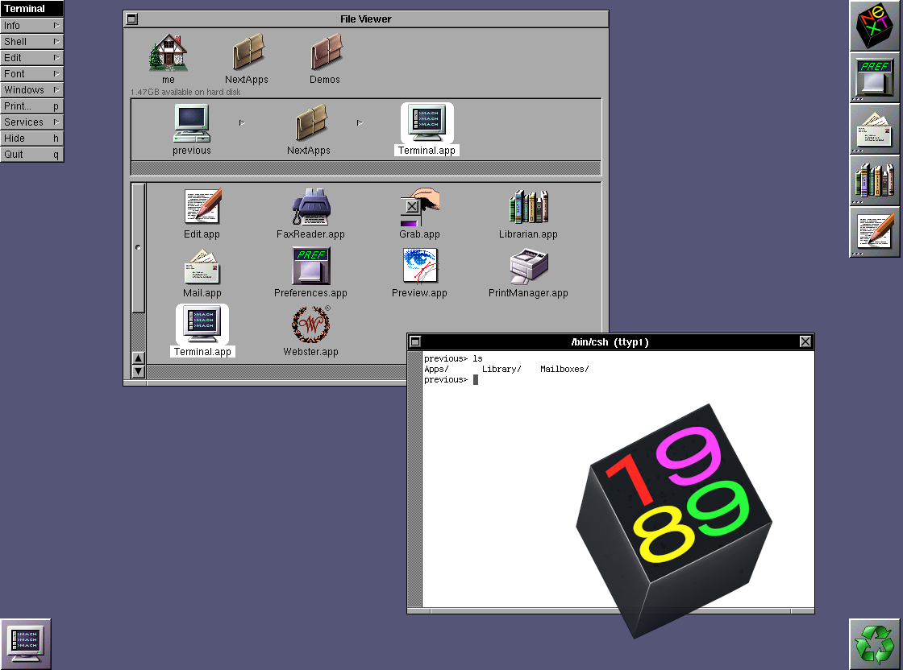

# 1989 — NeXT (Motorola 68K) emulator



1989 integrates the [Previous](https://previous.sourceforge.net/) NeXT
emulator (4.4 plus development fixes through SVN r1854) with the SDL3 desktop
conventions of the sibling “happy years” emulators (1983, 1984, 1985, 1986).
It is a C/C++ fork of Previous, retaining
its WinUAE m68k core and peripheral emulation, built through Autotools.

## Emulated machines

NeXT Computer (68030 Cube), NeXTcube, NeXTcube Turbo, NeXTstation,
NeXTstation Turbo, NeXTstation Color and NeXTstation Turbo Color, plus the
optional i860-based NeXTdimension graphics board.

## Desktop experience

- **F9 options overlay** with General, Media, Extensions and Tinker-gated
  Advanced tabs. Settings use a private draft with Save/Discard confirmation.
- Display, sound, Ethernet connection, tablet and printer toggles apply
  without rebooting the machine. Boot options take effect on the next boot.
- Hardware changes and fixed-disk replacement require an explicit restart
  confirmation. Removable-media changes touch only the selected drive.
- Media grouped by NeXT SCSI roles, with ID 1 system disk, ID 3 CD-ROM,
  reserved ID 7, and a next-boot `sdN` preview. Native floppy/MO drives are separate.
- **E** stages removable-media eject without disconnecting the drive; Save
  applies it without a reset. Enter loads/replaces; Delete disconnects with
  restart confirmation. Native file pickers remember directories; blank-image
  creation, device types and write protection are available in the same tab.
- Activity LEDs, function-key hints, toast notifications, window/fullscreen
  persistence, optional CRT scanlines and framebuffer filtering.
- **F4** PPM screenshot, **F6** GIF capture with optional FFmpeg optimization,
  **F11** fullscreen, **Ctrl+V** clipboard typing, **Ctrl+Enter** mouse release.
- **F5** confirmed restart and **F12** confirmed quit. Shut down NeXT inside
  the guest before restarting or quitting, especially with writable disks.

**F1 opens the legacy options menu.** It still provides detailed keyboard,
mouse, networking/NFS, memory and NeXTdimension settings. See the
[interface coverage table](docs/INTERFACE.md) for exactly what has and has
not moved to F9, and [CONTROLS.md](CONTROLS.md) for keyboard controls.

The core includes 68030/68040 CPU, MMU/FPU, DSP56001, monochrome/color
1120 × 832 video, SCSI, floppy, magneto-optical, sound, SLiRP networking
(optional pcap), and m68k/i860 debuggers. The companion `ditool` manipulates
NeXT disk images. The r1854 integration brings CPU/MMU corrections, improved
audio buffering, faster framebuffer conversion, DSP recording updates and
PNG/TIFF printer output. See [hardware status](docs/STATUS.md) and the
[pinned upstream integration notes](docs/UPSTREAM.md).

## Quick start

On Fedora:

```sh
sudo dnf install gcc gcc-c++ make autoconf automake libtool pkgconf-pkg-config sdl3-devel
autoreconf -iv
./configure
make -j"$(nproc)"
./1989
```

Firmware images supplied with Previous are included in `roms/` and installed
to `$(pkgdatadir)/roms`; a source-tree run finds `./roms`. See [ROMS.md](ROMS.md).
The default machine boots the ROM monitor. To boot an OS, choose a compatible
SCSI image at ID 1 (System disk) and boot device in F9 → Media, then confirm
the required restart. Existing configurations can keep their current IDs.
See [USAGE.md](USAGE.md) and [INSTALL.md](INSTALL.md).

```sh
make -C tests check
```

Tests cover strings, headers, clipboard typing, framebuffer conversion,
PPM/GIF and PNG/TIFF output, audio samples/timing, printer buffers, settings
application, and overlay save/discard/restart and file-selection behavior.
They do not replace testing a running NeXTstep installation.

## Project status

Native integration and the shared desktop UI are implemented, with interface
migration and compatibility validation ongoing. The browser frontend is
planned; `web/` is a placeholder. [Development.md](Development.md) describes
the module boundaries and [ROADMAP.md](ROADMAP.md) tracks remaining work.
Generated CPU sources are checked in; no CPU code-generation step is needed.

## License

GPL-2.0-or-later. See [LICENSE](LICENSE). The `ditool` Virtual File System
portion is MIT-licensed (see `src/slirp/rpc/vfs.c`).
